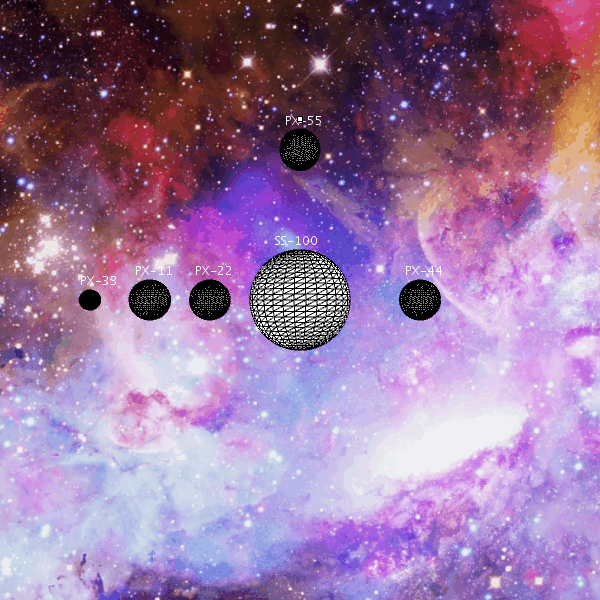

# CIU_P3

## Autor
Francisco Jose Santana Sosa

## Descripción
En esta práctica se ha realizado una simulación de un sistema planetario, se ha creado una estrella y cinco planetas (uno de ellos con un 
satélite). Para llevar a cabo esta simulación se han usado transformaciones 3d sobre esferas, además la simulación se basa en el uso
de pushMatrix() y popMatrix() para que dichas transformaciones resulten independientes entre los distinstos objetos.

## Referencias
Guión de prácticas

## Muestra de ejecución

